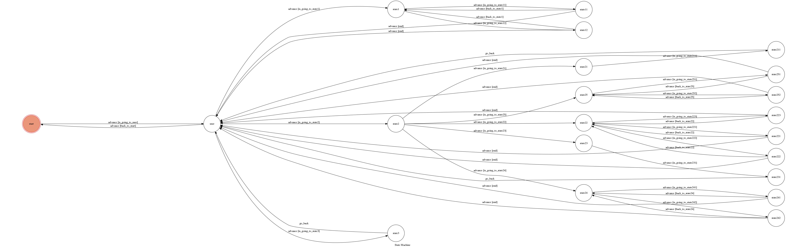

# TOC Project 2017

this is the final project for 2017-TOC

using : python3 , telegram-bot and pygraphviz 

## Setup

### Prerequisite
* Python 3

#### Install Dependency
```sh
pip install -r requirements.txt
```

* pygraphviz (For visualizing Finite State Machine)
    * [Setup pygraphviz on Ubuntu](http://www.jianshu.com/p/a3da7ecc5303)

### Secret Data

`API_TOKEN` and `WEBHOOK_URL` in app.py **MUST** be set to proper values.
Otherwise, you might not be able to run your code.

### Run Locally
You can either setup https server or using `ngrok` as a proxy.

**`ngrok` would be used in the following instruction**

```sh
ngrok http 5000
```

After that, `ngrok` would generate a https URL.

 set `WEBHOOK_URL` (in app.py) to `my-https-URL/hook/`.

#### Run my chatbot

```sh
python3 app.py
```

## Finite State Machine


## Usage
The initial state is set to `start`.

`start` state is triggered to `user` state by typing `start`

Every time `user` state is triggered to `advance` to another state, it will `go_back` to `user` state after the bot replies corresponding message.

And in some states, you can either choose `end` to go back to `user` or `back` to go back to `上一層`.
I have mentioned users which states have these transitions in the reply text, so don't worry.

If you want to leave `user` , you should type `seeya`


## Descriptions
我的bot功用是要尋找成大附近的醫院 ,診所 ,藥局。\n
First of all, users have three choices 醫院 ,診所 ,藥局
再來使用者輸入`醫院` ,`診所` ,`藥局`，就可以進到下一個步驟，剩下的選項都是打 \n
使用者要尋找的選項開頭第一個中文字開頭即可。
舉例來說如：
    醫院 ,診所 ,藥局 ->`診所`-> 皮膚科，眼科，內科，骨外科/復健科，牙科 -> `內科`-> 詠心診所->`詠`->(詠心診所的詳細內容 -> (因為沒有多其他內科選項，所以自動回到user state)

註：
    1.以上例子之粗體字為使用者輸入之中文字串
    2.這個bot沒有輸入錯誤偵測
    3.有`end`和`back`功能的state會在reply_text中顯示給使用者看
        


## Author
[yenning wan](https://github.com/debbywan)

